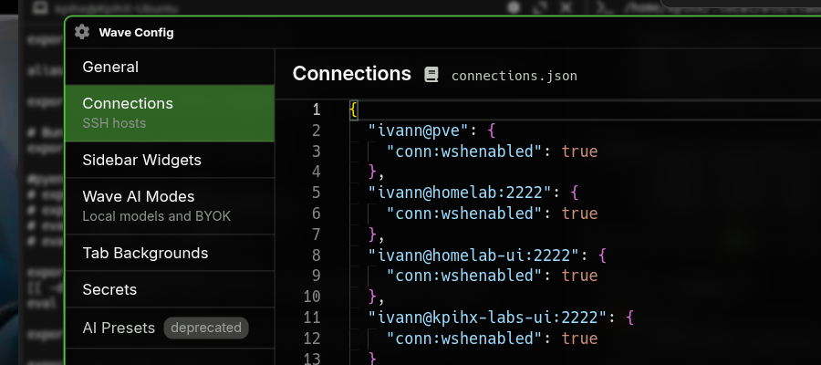
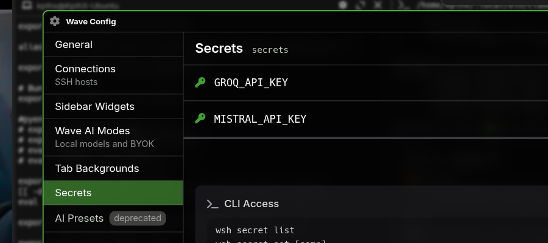

# 🌊 WaveTerm — The AI-Native Terminal

> **Machine:** KpihX-Ubuntu (Ubuntu 25.10)
> **Lived on:** 2026-03 · **Status:** Production-stable

---

For a long time I used the default GNOME terminal. It works. One window,
one shell, tab support if you need multiple. That covers 90% of what a
terminal does.

Then I started running multiple AI CLIs simultaneously — Claude Code in
one pane, Codex in another, checking GitHub in a third. GNOME terminal
handles that with splits and tabs, but everything is ad hoc: you launch,
type, arrange manually, every session. There's no memory of "I usually
want these things open together."

WaveTerm is built around a different idea. It's not a shell with a window.
It's a workspace where blocks — terminal sessions, SSH connections, web
views, file browsers — are first-class persistent objects. You arrange them
once. They're still there next time.

---

## 🧱 The Block Paradigm

In a classic terminal, you have a window containing a shell. In WaveTerm,
you have a workspace containing **blocks** — and a shell is just one type
of block.

```
Classic terminal                WaveTerm workspace
─────────────────               ─────────────────────────────────
┌───────────────┐               ┌──────────┬───────────┬────────┐
│               │               │ Terminal │  SSH:lab  │ GitHub │
│  one shell    │               │ (claude) │  session  │  web   │
│  one context  │               ├──────────┴───────────┤        │
│               │               │      Terminal        │        │
└───────────────┘               │    (local shell)     │        │
                                └──────────────────────┴────────┘
                                         ↑
                               Each block is independently
                               scrollable, movable, persistent
```

Each block type has its own controller:
- `term` — a shell session (local or remote via SSH)
- `web` — a browser view embedded inline
- `cmd` — a command that auto-runs when the block opens
- `preview` — file or URL preview

The block model is what makes the sidebar widgets useful.

---

## 📥 Install

Download the `.deb` from [waveterm.dev](https://waveterm.dev):

```bash
sudo dpkg -i waveterm_*.deb
```

WaveTerm also ships as an AppImage. The `.deb` is preferred on Ubuntu —
it integrates with system menus and gets system-managed updates.

Config files live in `~/.config/waveterm/`.

---

## 🧩 Sidebar Widgets

The sidebar is a column of shortcut buttons on the left edge of WaveTerm.
Each button opens a block with a pre-defined configuration — a specific
command, a URL, a connection. You define them once in `widgets.json` and
they appear immediately.

```
┌────┬────────────────────────────────────────┐
│ ✦  │                                        │
│    │  ← clicking "claude" opens:            │
│ ✦  │  cmd block running:                    │
│    │    ~/.local/bin/claude --continue       │
│ ✦  │                                        │
│    │  ← clicking "github" opens:            │
│ ✦  │  web block at https://github.com       │
│    │                                        │
│ ✦  │                                        │
│    │                                        │
└────┴────────────────────────────────────────┘
```

The config file is `~/.config/waveterm/widgets.json`. Each key is a widget:

```json
{
  "claude": {
    "icon": "sparkles",
    "label": "claude",
    "color": "#D97757",
    "blockdef": {
      "meta": {
        "view": "term",
        "controller": "cmd",
        "cmd": "/home/kpihx/.local/bin/claude --continue",
        "cwd": "~"
      }
    }
  },
  "github": {
    "icon": "brands@github",
    "label": "github",
    "blockdef": {
      "meta": {
        "view": "web",
        "url": "https://github.com"
      }
    }
  }
}
```

For `cmd` blocks, the `cmd` field is the full binary path. For AI CLIs that
auto-resume sessions, pass the right flag:
- Claude: `--continue` (resumes the last session)
- Codex: `resume <session-id>` (get the ID from `~/.codex/`)
- Gemini / Copilot: `--resume 1`

> **Template:** [`templates/waveterm-widgets.json`](templates/waveterm-widgets.json) — full template with claude, codex, gemini, copilot, vibe, github, gitlab. Copy to `~/.config/waveterm/widgets.json`, fill in `BINARY_PATH_*` and `SESSION_ID_*` placeholders.

---

## 🔌 SSH Connections

WaveTerm natively manages SSH connections — they appear as connection options
when you open a new block, and reconnect automatically if the session drops.

Connections live in `~/.config/waveterm/connections.json`:

```json
{
  "ivann@homelab:2222": {
    "conn:wshenabled": true
  }
}
```

With `conn:wshenabled: true`, WaveTerm installs `wsh` on the remote host —
its shell integration that enables block features (file browser, port
forwarding, remote `wsh` commands) over the same SSH connection.



You can also manage connections from **Wave Config → Connections** (the gear
icon in the top-left). The UI writes to `connections.json` directly.

---

## 🤖 BYOK AI Modes (Groq, Mistral)

WaveTerm has a built-in AI chat block. By default it points to whatever
API key you configure in Wave Config. The "BYOK" (Bring Your Own Key)
feature lets you register custom models from any OpenAI-compatible endpoint.

This is where Groq and Mistral come in: both expose OpenAI-compatible APIs,
so you can run Llama 4, Mistral Large, or Codestral directly inside
WaveTerm's AI blocks — at Groq's hardware speeds.

The AI modes config looks like this:

```json
{
  "groq-scout": {
    "display:name": "Groq Llama 4 Scout",
    "display:icon": "zap",
    "ai:apitype": "openai-chat",
    "ai:model": "meta-llama/llama-4-scout-17b-16e-instruct",
    "ai:endpoint": "https://api.groq.com/openai/v1/chat/completions",
    "ai:apitokensecretname": "GROQ_API_KEY",
    "ai:capabilities": ["tools", "images"]
  }
}
```

The `ai:apitokensecretname` field doesn't store the key directly — it names
a **wsh secret** that WaveTerm reads at runtime. That's the next section.

> **Template:** [`templates/waveterm-ai-modes.json`](templates/waveterm-ai-modes.json) — 6 models pre-configured: Groq Scout, Groq 120B, Groq Maverick, Mistral Large, Codestral, Pixtral. Copy the content into Wave Config → Wave AI Modes and set your secrets.

---

## 🔑 wsh Secrets

WaveTerm has its own secret store, accessible via `wsh` — the Wave Shell
helper installed alongside it.

```bash
# Store a secret
wsh secret set GROQ_API_KEY=<your-key>
wsh secret set MISTRAL_API_KEY=<your-key>

# List stored secrets
wsh secret list

# Read a secret (returns value)
wsh secret get GROQ_API_KEY
```

Secrets are stored encrypted in WaveTerm's local database — not in env vars,
not in files. The AI modes config reads them by name at runtime.



---

## ⚙️ Config File Map

```
~/.config/waveterm/
├── widgets.json        ← Sidebar buttons (AI CLIs, web shortcuts)
├── connections.json    ← SSH hosts (also editable via Wave Config UI)
├── ai-modes.json       ← BYOK custom AI models
└── settings.json       ← General Wave preferences
```

All files are plain JSON — readable, version-controllable, portable.

---

## 🚀 Quick Reference

```bash
# Open Wave Config
gear icon (top-left) or Ctrl+Shift+,

# wsh secrets
wsh secret set KEY=value
wsh secret list
wsh secret get KEY

# wsh remote (run wsh commands on connected host)
wsh conn <connection-name>

# Restart WaveTerm (applies widget/config changes)
close and reopen — no daemon restart needed
```
